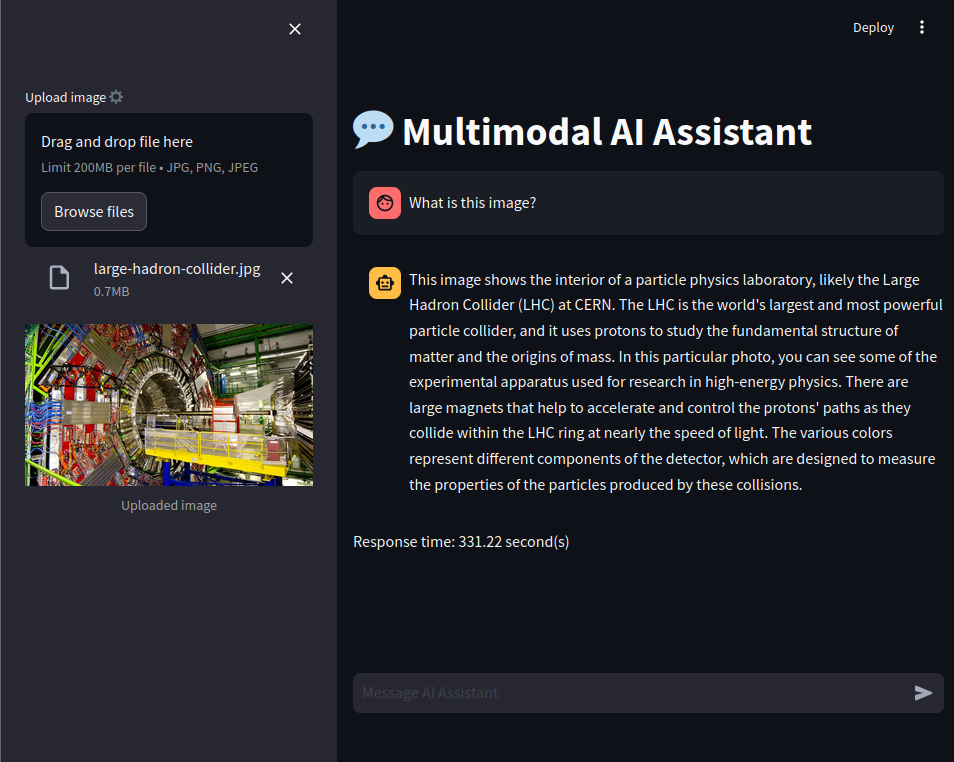

# Multimodal-Large-Language-Model (MLLM)

<!--  -->
[](#)
[](https://notyusheng.github.io/Multimodal-Large-Language-Model/index.html)

Thank you for checking out the Multimodal-Large-Language-Model project. Please note that this project was created for research purposes.

For a more robust and well-developed solution, you may consider using [open-webui/open-webui](https://github.com/open-webui/open-webui) with [ollama/ollama](https://github.com/ollama/ollama).

<!-- [[🤗Space DEMO](https://huggingface.co/spaces/NotYuSheng/MMLLM)] -->

<div align="center">
  
</div>

## Documentation
You can access the project documentation at [[GitHub Pages](https://notyusheng.github.io/Multimodal-Large-Language-Model/)].

## Host requirements
- **Docker**: [[Installation Guide](https://docs.docker.com/engine/install/)]
- **Docker Compose**: [[Installation Guide](https://docs.docker.com/compose/install/)]
- Compatibile with Linux and Windows Host
- Ensure port 8501 and 11434 are not already in use
- You should have at least 8 GB of RAM available to run the 7B models, 16 GB to run the 13B models, and 32 GB to run the 33B models. [[Source](https://github.com/ollama/ollama)]
- Project can be ran on either CPU or GPU

### Running on GPU
- **NVIDIA Container Toolkit** (Linux) [[Installation Guide](https://docs.nvidia.com/datacenter/cloud-native/container-toolkit/latest/install-guide.html)]
- **NVIDIA CUDA Toolkit** (Windows) [[Installation](https://developer.nvidia.com/cuda-downloads)]
- **WSL** (Windows) [[Installation](https://docs.docker.com/desktop/gpu/)]

## Tested Model(s)
| Model Name | Size | Link |
| --- | --- | --- |
| llava:7b | 4.7GB | [Link](https://www.ollama.com/library/llava:7b) |
| llava:34b | 20GB | [Link](https://www.ollama.com/library/llava:34b) |

Llava is pulled and loaded by default, other models from [Ollama](https://www.ollama.com/library) can be added into [ollama/ollama-build.sh](ollama/ollama-build.sh)

## Usage
> [!NOTE] 
Project will run on GPU by default. To run on CPU, use the `docker-compose.cpu.yml` instead

1.  Clone this repository and navigate to project folder
```
git clone https://github.com/NotYuSheng/Multimodal-Large-Language-Model.git
cd Multimodal-Large-Language-Model
```

2.  Build the Docker images:
```
docker-compose build
```

3.  Run images
```
docker-compose up -d
```

4.  Access Streamlit webpage from host
```
<host-ip>:8501
```

API calls to Ollama server can be made to
```
<host-ip>:11434
```
